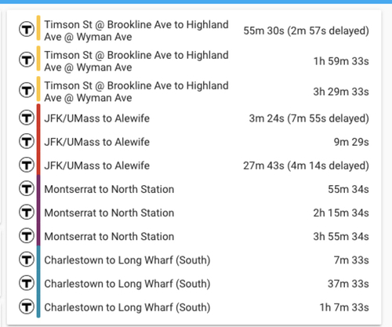

# mbta-card
This card shows predictions for a [MBTA prediction sensor](https://github.com/dhanani94/mbta_predictions). 



## Installation
The custom card code is located [here](/mbta-card.js). Copying the `mbta-card.js` file into the `<config directory>/www/mbta-card.js` directory (alongside the `configuration.yml` file) for users using HASSIO. 

## Configuration

Link `mbta-card` inside you .
To enable this card, add the following lines to your `ui-lovelace.yaml` file:

```yaml
resources:
  - type: module
    url: /local/mbta-card.js
```

Set up the visualisations for the MBTA sensors. (the sensors must already be [set up](https://github.com/dhanani94/mbta_predictions))

example `ui-lovelace.yaml` card: 

```yaml
 - entities:
      - entity: sensor.mbta_jfk_umass
        limit: 3
        offset_minutes: 7
      - entity: sensor.mbta_savin_hill
        limit: 2
        offset_minutes: 6
      - entity: sensor.mbta_south_station
        limit: 2
        offset_minutes: 3
    icon: /local/imgs/MBTA.png
    theme: default
    type: 'custom:mbta-card'
```

### Configuration Variables
#### entity
> (string) (Required) the entity name of the sensor
#### offset_minutes
> (int) (Optional) the minimum minutes remaining before arrival (default: 0)
#### limit
> (int) (Optional) the maximum number of predictions to display (default: 10)
#### icon
> (path) (Required) location of the [T logo](./images/MBTA.png)

## Future Plans 

* Add support for buses 
* Create custom compnent in HACS 
* [Buy me coffee?](https://www.buymeacoffee.com/dhanani94)

## inspirations

* [Munich public transport departure card](https://community.home-assistant.io/t/lovelace-munich-public-transport-departure-card/59622)
* [RMV transport departures](https://community.home-assistant.io/t/rmv-transport-departures/63935)
* [MVG](https://www.home-assistant.io/integrations/mvglive)
